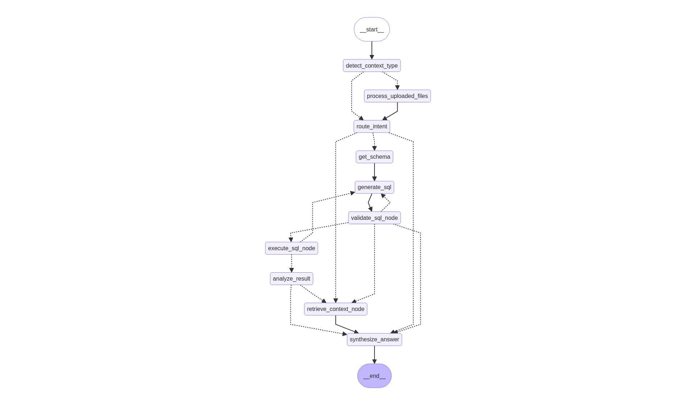

# DA Agent Lab

A LangGraph-based Data Analyst Agent that answers business and data questions through SQL query execution, RAG over business documentation, deterministic analysis, and production-grade observability.

---



---

## Overview

The agent handles three classes of questions:

| Class | Example | Route |
|-------|---------|-------|
| **SQL** | *"DAU 7 ngày gần đây có giảm không?"* | Schema → SQL Gen → Execute → Analyze |
| **RAG** | *"Retention D1 là gì?"* | Retrieve metric definitions → Synthesize |
| **Mixed** | *"Retention tuần này giảm từ ngày nào và metric này tính như thế nào?"* | SQL path + RAG retrieval → Synthesize |

---

## Architecture

### Main Graph (V2)

```
User Query
    │
    ▼
detect_context_type ──► [has CSV?] ──► process_uploaded_files
    │                                           │
    └───────────────────────────────────────────┘
                         │
                         ▼
                    route_intent
                         │
          ┌──────────────┼──────────────┐
        sql/mixed        rag         unknown
          │               │               │
     task_planner  retrieve_context   synthesize_answer
          │               │
    [Send fan-out]        └──────────────────┐
          │                                  │
    ┌─────┴──────┐                           │
  sql_worker  standalone_viz                 │
          │                                  │
    aggregate_results ────────────────────── ┤
          │                                  │
        mixed? ──► retrieve_context_node     │
          │               │                  │
          └───────────────┴──────────────────┘
                          │
                    synthesize_answer
                          │
                     AnswerPayload
```

### SQL Worker Subgraph

Each task dispatched via the Send API runs through an isolated SQL Worker subgraph with a built-in self-correction loop:

```
_task_get_schema
    │
    ▼
_task_generate_sql ◄────────────────────────────┐
    │                                            │
    ▼                                            │ retry (≤ 2x)
_task_validate_sql                               │ with error context
    │                                            │
    ├── [invalid] ───────────────────────────────┘
    │
    ▼
_task_execute_sql
    │
    ├── [retryable error] ────────────────────────┘
    │
    ▼
_task_generate_visualization  (optional)
```

**SQL safety** is enforced deterministically before execution: only `SELECT` and CTEs are allowed; `INSERT`, `UPDATE`, `DELETE`, `DROP`, and all DDL statements are blocked.

### E2B Visualization

```
SQL Result / Raw Data
    │
    ▼
LLM Code Generation (matplotlib / seaborn / pandas)
    │
    ├── success ──► E2B Sandbox ──► Base64 PNG
    │
    └── failure ──► Template Fallback ──► E2B Sandbox ──► Base64 PNG
```

---

## Tech Stack

| Layer | Technology |
|-------|-----------|
| Orchestration | [LangGraph](https://langchain-ai.github.io/langgraph/) — explicit state, conditional edges, Send API |
| LLM Backend | OpenAI-compatible API (configurable via `LLM_API_URL`) |
| Database | SQLite — analytics warehouse + LangGraph checkpointer |
| Vector Store | ChromaDB — metric definitions, business context |
| Observability | [Langfuse](https://langfuse.com/) — traces, spans, prompt versioning |
| Visualization | [E2B](https://e2b.dev/) — sandboxed Python chart execution |
| MCP Server | [FastMCP](https://gofastmcp.com/) — 7 tools exposed as MCP endpoints |
| Logging | [Loguru](https://loguru.readthedocs.io/) |
| UI | [Streamlit](https://streamlit.io/) |
| Package Manager | [uv](https://docs.astral.sh/uv/) |

---

## Project Structure

```
app/
├── graph/
│   ├── state.py                    # AgentState, TaskState, AnswerPayload
│   ├── graph.py                    # build_sql_v1_graph(), build_sql_v2_graph()
│   ├── nodes.py                    # All node functions
│   ├── edges.py                    # Routing / conditional-edge functions
│   ├── sql_worker_graph.py         # SQL worker subgraph (V2)
│   ├── visualization_node.py       # E2B chart generation node
│   ├── standalone_visualization.py # Standalone viz worker
│   └── error_classifier.py         # SQL error taxonomy
├── tools/
│   ├── get_schema.py
│   ├── query_sql.py
│   ├── validate_sql.py
│   ├── retrieve_metric_definition.py
│   ├── retrieve_business_context.py
│   ├── dataset_context.py
│   ├── auto_register.py
│   ├── csv_profiler.py
│   ├── csv_validator.py
│   └── visualization.py
├── prompts/                        # Prompt modules with Langfuse versioning
├── rag/                            # ChromaDB indexing and retrieval
├── observability/                  # RunTracer, span schemas
├── memory/                         # Cross-turn context store
└── main.py

mcp_server/                         # FastMCP server (7 exposed tools)
data/seeds/                         # Seed database creation
docs/research/rag/                  # Markdown docs indexed for RAG
evals/                              # Eval runner, metrics, case contracts
tests/                              # Pytest unit tests
streamlit_app.py
```

---

## Quick Start

**Prerequisites:** Python 3.11+, [`uv`](https://docs.astral.sh/uv/)

```bash
git clone https://github.com/thangquang09/da-agent-project.git
cd da-agent-project

uv sync
cp .env.example .env          # fill in credentials

uv run python data/seeds/create_seed_db.py
uv run python -m app.rag.index_docs

uv run streamlit run streamlit_app.py   # web UI
uv run python -m app.main               # CLI
uv run python -m mcp_server.server      # MCP server
```

---

## Configuration

```bash
LLM_API_URL=https://api.openai.com/v1/chat/completions
LLM_API_KEY=your-api-key

DEFAULT_MODEL=gpt-4o
MODEL_FALLBACK=gpt-4o-mini

SQLITE_DB_PATH=data/warehouse/analytics.db

LANGFUSE_PUBLIC_KEY=pk-lf-...
LANGFUSE_SECRET_KEY=sk-lf-...
LANGFUSE_HOST=https://cloud.langfuse.com

E2B_API_KEY=your-e2b-api-key

ENABLE_MCP_TOOL_CLIENT=false
MCP_HTTP_URL=http://127.0.0.1:8000/mcp
```

---

## Response Format

```json
{
  "answer": "DAU trong 7 ngày gần đây có xu hướng giảm nhẹ...",
  "evidence": ["DAU ngày 2026-03-25: 12,450", "DAU ngày 2026-03-31: 11,200"],
  "confidence": "high",
  "used_tools": ["get_schema", "generate_sql", "execute_sql", "analyze_result"],
  "generated_sql": "SELECT date, dau FROM daily_metrics ORDER BY date DESC LIMIT 7",
  "visualization": { "type": "line", "image_base64": "..." }
}
```

---

## Tools

| Tool | Category | Description |
|------|----------|-------------|
| `get_schema` | Schema | DB schema overview — tables, columns, types |
| `describe_table` | Schema | Single table schema |
| `list_tables` | Schema | All table names in the DB |
| `query_sql` | SQL | Execute validated SELECT query (max 200 rows) |
| `validate_sql` | SQL | Deterministic safety validation |
| `retrieve_metric_definition` | RAG | Semantic search over metric definitions |
| `retrieve_business_context` | RAG | Semantic search over business docs |
| `dataset_context` | RAG | Dataset-level context chunks |
| `validate_csv` | File | Check encoding, delimiter, schema |
| `profile_csv` | File | Column stats, type inference, row count |
| `auto_register_csv` | File | Register CSV as SQLite table |
| `check_table_exists` | Utility | Table existence check |

**MCP-exposed** (via FastMCP at `:8000/mcp`): `get_schema`, `query_sql`, `validate_csv`, `profile_csv`, `auto_register_csv`, `retrieve_metric_definition`, `dataset_context`.

---

## Observability

Every run is traced to Langfuse with run-level and node-level spans:

- **Run-level:** `run_id`, `intent`, `total_steps`, `total_latency_ms`, `total_token_usage`, `status`
- **Node-level:** `node_name`, `latency_ms`, `input_summary`, `output_summary`, `error_class`

**Failure taxonomy:** `ROUTING_ERROR` · `SQL_GENERATION_ERROR` · `SQL_VALIDATION_ERROR` · `SQL_EXECUTION_ERROR` · `RAG_RETRIEVAL_ERROR` · `SYNTHESIS_ERROR` · `CSV_PROCESSING_ERROR` · `VISUALIZATION_ERROR` · `STEP_LIMIT_REACHED`

---

## Evaluation

```bash
uv run python evals/runner.py
uv run python evals/runner.py --suite spider_dev
```

| Metric | Gate |
|--------|------|
| `routing_accuracy` | ≥ 0.90 |
| `sql_validity_rate` | ≥ 0.90 |
| `tool_path_accuracy` | ≥ 0.95 |
| `answer_format_validity` | 1.00 |
| `groundedness_pass_rate` | ≥ 0.70 |

---

## License

MIT
