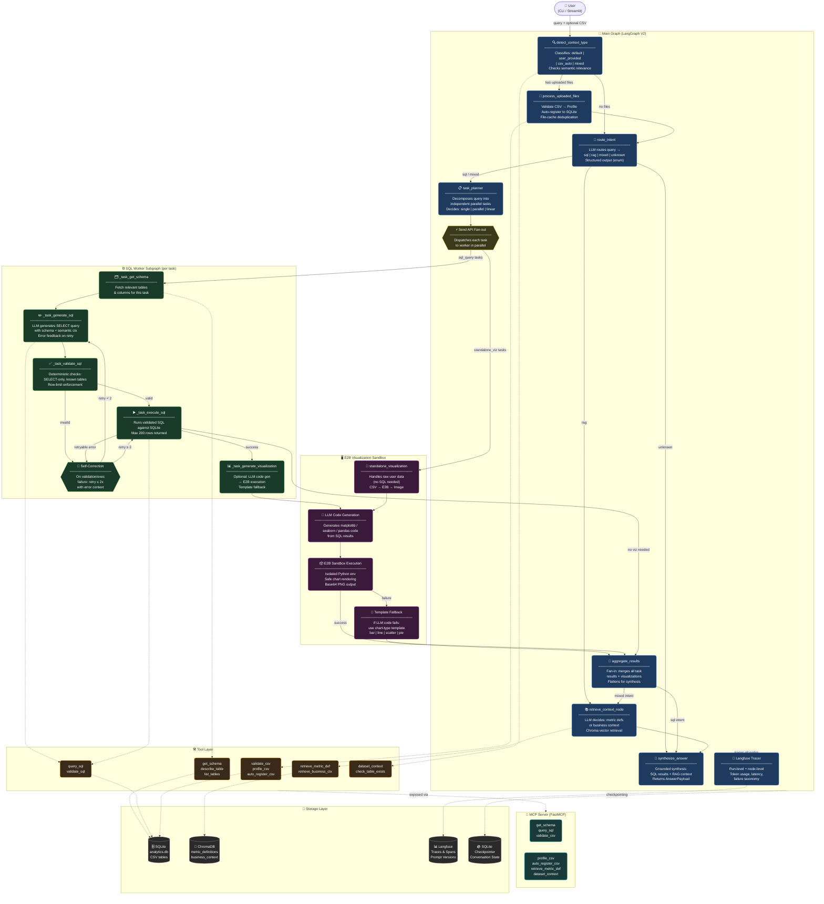

# DA Agent Lab 🤖📊

> A **LangGraph-based Data Analyst Agent** that answers business and data questions through a combination of SQL query execution, RAG over business documentation, deterministic analysis, and production-grade observability.

<p align="center">
  
</p>

---

## Table of Contents

- [Overview](#overview)
- [Key Features](#key-features)
- [Architecture](#architecture)
  - [System Architecture Diagram](#system-architecture-diagram)
  - [Main Graph (V2)](#main-graph-v2)
  - [SQL Worker Subgraph](#sql-worker-subgraph)
  - [E2B Visualization Node](#e2b-visualization-node)
- [Project Structure](#project-structure)
- [Tech Stack](#tech-stack)
- [Quick Start](#quick-start)
- [Configuration](#configuration)
- [Usage](#usage)
- [Tools & MCP Server](#tools--mcp-server)
- [Observability](#observability)
- [Evaluation](#evaluation)
- [Design Decisions](#design-decisions)

---

## Overview

DA Agent Lab demonstrates a **realistic applied AI system** aligned with AI/Agent engineering roles. It is not a toy chatbot — it is a constrained, observable, and evaluatable agentic analytics pipeline.

The agent handles three classes of questions:

| Class | Example | Route |
|-------|---------|-------|
| **SQL** | *"DAU 7 ngày gần đây có giảm không?"* | Schema → SQL Gen → Execute → Analyze |
| **RAG** | *"Retention D1 là gì?"* | Retrieve metric definitions → Synthesize |
| **Mixed** | *"Retention tuần này giảm từ ngày nào và metric này tính như thế nào?"* | SQL path + RAG retrieval → Synthesize |

The system supports **CSV upload**, **parallel task planning**, **self-correcting SQL**, and **E2B sandboxed chart generation**.

---

## Key Features

- 🧠 **Intent-aware routing** — classifies every query into `sql`, `rag`, `mixed`, or `unknown`
- 🔄 **Plan-and-Execute (V2)** — decomposes complex queries into parallel tasks via LangGraph's `Send` API
- 🔁 **Self-correcting SQL** — retries up to 2 times with error feedback on validation or execution failure
- 📁 **CSV upload & auto-registration** — uploads are validated, profiled, and registered to SQLite automatically
- 📊 **E2B Visualization** — LLM-generated Python charts executed in isolated E2B sandboxes
- 🔒 **SQL Safety** — deterministic validation blocks all non-`SELECT` statements before execution
- 🔍 **Full observability** — every node traced to Langfuse with token usage, latency, and error taxonomy
- 🧪 **Evaluation framework** — routing accuracy, SQL validity, tool-path accuracy, groundedness gates
- 🔌 **MCP-compatible tools** — all tools designed with clean input/output schemas, exposed via FastMCP server
- 💾 **Prompt versioning** — prompts managed via Langfuse with local fallback and TTL caching

---

## Architecture

### System Architecture Diagram

The diagram below shows the complete system: the **Main Graph (V2)** with its plan-and-execute fan-out, the **SQL Worker Subgraph** handling per-task SQL execution and visualization, and the **E2B Visualization Node** for sandboxed chart generation.



---

### Main Graph (V2)

The V2 graph implements a **Plan-and-Execute** architecture. On receiving a query:

1. **`detect_context_type`** — LLM classifies the context (default DB, user-provided CSV, auto-detected CSV, or mixed) and saves to context memory for future turns.
2. **`process_uploaded_files`** — If CSVs are present: validate → profile → auto-register to SQLite with deduplication via file hash cache.
3. **`route_intent`** — LLM routes to `sql`, `rag`, `mixed`, or `unknown` using structured output (enum-constrained).
4. **`task_planner`** — For SQL/mixed queries: decomposes the question into independent parallelizable `TaskState` objects with `execution_mode` (`single | parallel | linear`).
5. **Send API Fan-out** — Each task is dispatched to either `sql_worker` (for data queries) or `standalone_visualization` (for chart-only tasks) in parallel.
6. **`aggregate_results`** — Fan-in node that merges all parallel task results and flattened visualizations.
7. **`retrieve_context_node`** — For RAG/mixed: LLM decides between metric definition retrieval or business context retrieval via ChromaDB.
8. **`synthesize_answer`** — Combines all evidence into a grounded `AnswerPayload` with `answer`, `evidence`, `confidence`, `used_tools`, and `generated_sql`.

#### Routing Logic

```
detect_context_type ──► has CSV? ──► process_uploaded_files ──► route_intent
                                                                      │
                         ┌────────────────────────┬──────────────────┤
                       sql/mixed                  rag             unknown
                         │                         │                  │
                    task_planner          retrieve_context_node   synthesize_answer
                         │                         │
                   [Send fan-out]            synthesize_answer
                         │
              sql_worker / standalone_viz
                         │
                  aggregate_results
                         │
              mixed? ► retrieve_context_node ──► synthesize_answer
              sql?  ──────────────────────────► synthesize_answer
```

---

### SQL Worker Subgraph

Each task dispatched via the Send API runs through an isolated SQL Worker subgraph:

```
_task_get_schema → _task_generate_sql → _task_validate_sql → _task_execute_sql → _task_generate_visualization
                           ▲                    │                     │
                           │                    └─ invalid ──┐        └─ retryable error ──┐
                           │                                 ▼                              ▼
                           └──────────────────────── Self-Correction (retry ≤ 2x with error context)
```

**Self-Correction Loop:**
- On `SQL_VALIDATION_ERROR`: error message injected into prompt → regenerate SQL (max 2 retries)
- On `SQL_EXECUTION_ERROR` (retryable): same feedback loop
- On non-retryable errors (e.g., `SQL_SAFETY_VIOLATION`): fail immediately with logged taxonomy

**SQL Safety Constraints** (deterministic, not LLM-based):
- ❌ Blocked: `INSERT`, `UPDATE`, `DELETE`, `DROP`, `ALTER`, `TRUNCATE`, `CREATE`, `REPLACE`
- ✅ Allowed: `SELECT` and CTEs (`WITH ... SELECT`)
- ✅ Row limit: max 200 rows enforced at validation time

---

### E2B Visualization Node

Chart generation uses a two-stage approach with graceful fallback:

```
SQL Result / Raw Data
        │
        ▼
LLM Code Generation (matplotlib / seaborn / pandas)
        │
        ├── Success ──► E2B Sandbox Execution ──► Base64 PNG ──► Embed in response
        │
        └── Failure ──► Template Fallback (bar | line | scatter | pie | histogram)
                               │
                               └── E2B Sandbox Execution ──► Base64 PNG
```

**Standalone Visualization** handles user-provided raw data (e.g., *"make a bar chart of: 10, 20, 30"*) without requiring a SQL query — raw data is parsed, converted to CSV, uploaded to E2B, and charted directly.

---

## Project Structure

```text
da-agent-project/
├── app/
│   ├── graph/
│   │   ├── state.py                   # AgentState, TaskState, AnswerPayload
│   │   ├── graph.py                   # build_sql_v1_graph(), build_sql_v2_graph()
│   │   ├── nodes.py                   # All 14 node functions
│   │   ├── edges.py                   # All routing / conditional-edge functions
│   │   ├── sql_worker_graph.py        # SQL worker subgraph (V2)
│   │   ├── visualization_node.py      # E2B chart generation node
│   │   ├── standalone_visualization.py# Standalone viz worker (no SQL)
│   │   ├── context_resolver.py        # Resolves schema + semantic context
│   │   ├── error_classifier.py        # SQL error taxonomy classification
│   │   └── run_config.py              # Per-run config (thread_id, recursion limit)
│   ├── tools/
│   │   ├── get_schema.py              # DB schema retrieval
│   │   ├── query_sql.py               # SQL execution (row limit enforced)
│   │   ├── validate_sql.py            # Deterministic SQL safety validation
│   │   ├── retrieve_metric_definition.py
│   │   ├── retrieve_business_context.py
│   │   ├── dataset_context.py         # Dataset-level RAG context
│   │   ├── auto_register.py           # CSV → SQLite registration
│   │   ├── csv_profiler.py            # Column stats, type inference
│   │   ├── csv_validator.py           # Encoding, delimiter, schema checks
│   │   ├── visualization.py           # E2B sandbox chart execution
│   │   ├── check_table_exists.py
│   │   └── mcp_client.py              # MCP tool client adapter
│   ├── prompts/
│   │   ├── manager.py                 # Langfuse prompt versioning + TTL cache
│   │   ├── router.py                  # Intent routing prompt
│   │   ├── sql.py                     # SQL generation prompt
│   │   ├── analysis.py                # Result analysis prompt
│   │   ├── synthesis.py               # Answer synthesis prompt
│   │   └── context_detection.py       # Context type classification prompt
│   ├── rag/
│   │   ├── index_docs.py              # Index markdown docs into ChromaDB
│   │   └── retriever.py               # Semantic search over docs
│   ├── observability/
│   │   ├── tracer.py                  # RunTracer: Langfuse spans per node
│   │   └── schemas.py                 # Trace payload schemas
│   ├── memory/
│   │   └── context_store.py           # Cross-turn context memory
│   ├── llm/
│   │   └── client.py                  # OpenAI-compatible HTTP client
│   ├── config.py                      # Settings via env vars + dotenv
│   ├── logger.py                      # Loguru setup
│   └── main.py                        # CLI entrypoint
│
├── mcp_server/
│   ├── server.py                      # FastMCP server (7 exposed tools)
│   ├── tools.py                       # Tool implementations for MCP
│   ├── tools/
│   │   └── csv_context.py
│   ├── config.py                      # MCP-specific config
│   └── schemas.py                     # MCP request/response schemas
│
├── data/
│   ├── seeds/
│   │   └── create_seed_db.py          # Creates analytics.db with sample data
│   └── warehouse/
│       └── analytics.db               # SQLite warehouse (gitignored)
│
├── docs/
│   ├── research/
│   │   └── rag/
│   │       ├── metric_definitions.md  # KPI definitions for RAG
│   │       ├── retention_rules.md     # Retention business rules
│   │       ├── revenue_caveats.md     # Revenue metric caveats
│   │       └── data_quality_notes.md  # Data quality documentation
│   └── thangquang09/
│       └── langgraph_graph.png        # Auto-generated graph visualization
│
├── evals/
│   ├── cases/
│   │   ├── dev/                       # Dev eval sets (Vietnamese + English)
│   │   └── test/                      # Test eval sets (Spider benchmark)
│   ├── runner.py                      # Eval runner with gate thresholds
│   ├── metrics/
│   │   ├── execution_accuracy.py      # SQL result correctness
│   │   ├── llm_judge.py               # LLM-as-judge answer quality
│   │   └── spider_exact_match.py      # Spider benchmark metric
│   ├── groundedness.py                # Numeric grounding checks
│   └── case_contracts.py              # Eval case schema validation
│
├── tests/                             # Pytest unit tests
├── streamlit_app.py                   # Web UI
├── export_graph.py                    # Re-generate graph PNG/SVG
├── pyproject.toml
└── .env.example                       # Environment variable template
```

---

## Tech Stack

| Layer | Technology |
|-------|-----------|
| **Orchestration** | [LangGraph](https://langchain-ai.github.io/langgraph/) — explicit state, conditional edges, Send API |
| **LLM Backend** | OpenAI-compatible API (configurable via `LLM_API_URL`) |
| **Database** | SQLite (local analytics warehouse + LangGraph checkpointer) |
| **Vector Store** | ChromaDB (metric definitions, business context) |
| **Observability** | [Langfuse](https://langfuse.com/) — traces, spans, prompt versioning |
| **Visualization** | [E2B](https://e2b.dev/) sandboxed Python execution (matplotlib/seaborn) |
| **MCP Server** | [FastMCP](https://gofastmcp.com/) — 7 tools exposed as MCP endpoints |
| **Logging** | [Loguru](https://loguru.readthedocs.io/) |
| **UI** | [Streamlit](https://streamlit.io/) |
| **Package Manager** | [uv](https://docs.astral.sh/uv/) |
| **Testing** | pytest |

---

## Quick Start

### Prerequisites

- Python 3.11+
- [`uv`](https://docs.astral.sh/uv/) package manager

### 1. Clone & install

```bash
git clone https://github.com/thangquang09/da-agent-project.git
cd da-agent-project
uv sync
```

### 2. Configure environment

```bash
cp .env.example .env
# Edit .env with your credentials (see Configuration section below)
```

### 3. Seed the database

```bash
uv run python data/seeds/create_seed_db.py
```

### 4. Index RAG documents

```bash
uv run python -m app.rag.index_docs
```

### 5. Run

```bash
# Streamlit web UI
uv run streamlit run streamlit_app.py

# CLI
uv run python -m app.main

# MCP server
uv run python -m mcp_server.server
```

---

## Configuration

All settings are loaded from environment variables (with `.env` file support via `python-dotenv`).

```bash
# ── LLM ──────────────────────────────────────────────────────
LLM_API_URL=https://api.openai.com/v1/chat/completions   # OpenAI-compatible endpoint
LLM_API_KEY=your-api-key-here

# ── Models ───────────────────────────────────────────────────
DEFAULT_MODEL=gpt-4o
DEFAULT_ROUTER_MODEL=gpt-4o
DEFAULT_SYNTHESIS_MODEL=gpt-4o
MODEL_FALLBACK=gpt-4o-mini

# ── Database ─────────────────────────────────────────────────
SQLITE_DB_PATH=data/warehouse/analytics.db

# ── Langfuse Observability ───────────────────────────────────
ENABLE_LANGFUSE=true
LANGFUSE_PUBLIC_KEY=pk-lf-...
LANGFUSE_SECRET_KEY=sk-lf-...
LANGFUSE_HOST=https://cloud.langfuse.com
LANGFUSE_PROJECT_NAME=da-agent-project
LANGFUSE_PROJECT_ID=your-project-id
LANGFUSE_ORG_ID=your-org-id
LANGFUSE_CLOUD_REGION=EU

# ── E2B Visualization ────────────────────────────────────────
E2B_API_KEY=your-e2b-api-key

# ── MCP Tool Client ──────────────────────────────────────────
ENABLE_MCP_TOOL_CLIENT=false
MCP_TRANSPORT=streamable-http
MCP_HTTP_URL=http://127.0.0.1:8000/mcp

# ── Misc ─────────────────────────────────────────────────────
ENABLE_LLM_SQL_GENERATION=true
PROMPT_CACHE_TTL_SECONDS=300
```

---

## Usage

### Example Queries

```python
from app.main import run_agent

# SQL query
result = run_agent("DAU 7 ngày gần đây có giảm không?")

# RAG query
result = run_agent("Retention D1 được tính như thế nào?")

# Mixed query
result = run_agent("Revenue tuần này giảm từ ngày nào và metric này bao gồm những gì?")

# With CSV upload
result = run_agent(
    "Top 5 sản phẩm bán chạy nhất?",
    uploaded_files=["data/sales.csv"]
)
```

### Response Format

```json
{
  "answer": "DAU trong 7 ngày gần đây có xu hướng giảm nhẹ...",
  "evidence": ["DAU ngày 2026-03-25: 12,450", "DAU ngày 2026-03-31: 11,200"],
  "confidence": "high",
  "used_tools": ["get_schema", "generate_sql", "execute_sql", "analyze_result"],
  "generated_sql": "SELECT date, dau FROM daily_metrics ORDER BY date DESC LIMIT 7",
  "visualization": { "type": "line", "image_base64": "..." }
}
```

---

## Tools & MCP Server

### Core Tool Inventory

| Tool | Category | Description |
|------|----------|-------------|
| `get_schema` | Schema | DB schema overview (tables, columns, types) |
| `describe_table` | Schema | Single table schema with column descriptions |
| `list_tables` | Schema | All table names in the database |
| `query_sql` | SQL | Execute validated SELECT query (max 200 rows) |
| `validate_sql` | SQL | Deterministic safety validation (SELECT-only) |
| `retrieve_metric_definition` | RAG | Semantic search over metric definitions |
| `retrieve_business_context` | RAG | Semantic search over business documentation |
| `dataset_context` | RAG | Dataset-level context chunks |
| `validate_csv` | File | Check CSV encoding, delimiter, schema |
| `profile_csv` | File | Column stats, type inference, row count |
| `auto_register_csv` | File | Register CSV as SQLite table |
| `check_table_exists` | Utility | Check if a table exists in the DB |

### MCP Server

The 7 most useful tools are exposed via a **FastMCP** server for external integrations:

```bash
# Start MCP server
uv run python -m mcp_server.server

# Available endpoints (Streamable HTTP at :8000/mcp):
# - get_schema(db_path?)
# - query_sql(sql, row_limit?, db_path?)
# - validate_csv(file_path)
# - profile_csv(file_path, table_name?, encoding?, delimiter?)
# - auto_register_csv(file_path, table_name?, db_path?)
# - retrieve_metric_definition(query, top_k?)
# - dataset_context(db_path?)
```

---

## Observability

Every agent run is traced to **Langfuse** with run-level and node-level spans.

### Run-Level Trace

| Field | Description |
|-------|-------------|
| `run_id` | UUID per run |
| `intent` | Routed intent (`sql` / `rag` / `mixed`) |
| `total_steps` | Node execution count |
| `total_latency_ms` | End-to-end latency |
| `total_token_usage` | Aggregated token count |
| `status` | `success` / `error` |

### Node-Level Span

| Field | Description |
|-------|-------------|
| `node_name` | e.g., `generate_sql`, `synthesize_answer` |
| `latency_ms` | Node execution time |
| `input_summary` | Truncated input state |
| `output_summary` | Truncated output state |
| `error_class` | From failure taxonomy (see below) |

### Failure Taxonomy

| Code | Trigger |
|------|---------|
| `ROUTING_ERROR` | Intent classification failure |
| `SQL_GENERATION_ERROR` | LLM fails to produce valid SQL structure |
| `SQL_VALIDATION_ERROR` | Safety or syntax validation failure |
| `SQL_EXECUTION_ERROR` | Runtime query failure |
| `RAG_RETRIEVAL_ERROR` | Vector search failure |
| `SYNTHESIS_ERROR` | Answer generation failure |
| `CSV_PROCESSING_ERROR` | Upload validation or registration failure |
| `VISUALIZATION_ERROR` | E2B sandbox execution failure |
| `STEP_LIMIT_REACHED` | Recursion limit exceeded |

---

## Evaluation

```bash
# Run full eval suite
uv run python evals/runner.py

# Run on specific cases
uv run python evals/runner.py --suite vietnamese_queries

# Run Spider benchmark
uv run python evals/runner.py --suite spider_dev
```

### Gate Thresholds

| Metric | Gate | Description |
|--------|------|-------------|
| `routing_accuracy` | ≥ 0.90 | Expected vs predicted intent |
| `sql_validity_rate` | ≥ 0.90 | % of queries with valid generated SQL |
| `tool_path_accuracy` | ≥ 0.95 | Expected vs actual tool-call sequence |
| `answer_format_validity` | 1.00 | `AnswerPayload` completeness |
| `groundedness_pass_rate` | ≥ 0.70 | Numeric claims grounded in retrieved evidence |

### Eval Case Format

```jsonc
{
  "id": "case_001",
  "suite": "vietnamese_queries",
  "language": "vi",
  "query": "DAU 7 ngày gần đây có giảm không?",
  "expected_intent": "sql",
  "expected_tools": ["get_schema", "generate_sql", "execute_sql", "analyze_result"],
  "should_have_sql": true,
  "expected_context_type": "default"
}
```

---

## Design Decisions

### Why LangGraph?
Explicit state management and conditional edges make the control flow inspectable and debuggable. Every node transition is observable and can be replayed from a checkpoint.

### Why Plan-and-Execute (V2)?
Complex analytical questions often require multiple independent SQL queries (e.g., "compare metric A with metric B over time"). The Send API enables true parallelism without complex handcrafted state machines.

### Why Deterministic SQL Validation?
LLM-generated SQL is validated with deterministic Python — not re-asked to the LLM — before execution. This keeps safety guarantees hard and predictable, and makes failures debuggable.

### Why E2B for Visualization?
LLM-generated Python code executing in an isolated sandbox prevents arbitrary code from touching the host environment while enabling flexible, data-driven chart generation.

### Why Langfuse for Observability?
Prompt versioning, span-level tracing, and token usage tracking in a single tool. The agent's behavior can be replayed, inspected, and regressed against from the Langfuse dashboard.

---

## License

MIT

---

<p align="center">
  Built with ❤️ as an applied AI portfolio project · <a href="https://github.com/thangquang09/da-agent-project">GitHub</a>
</p>
