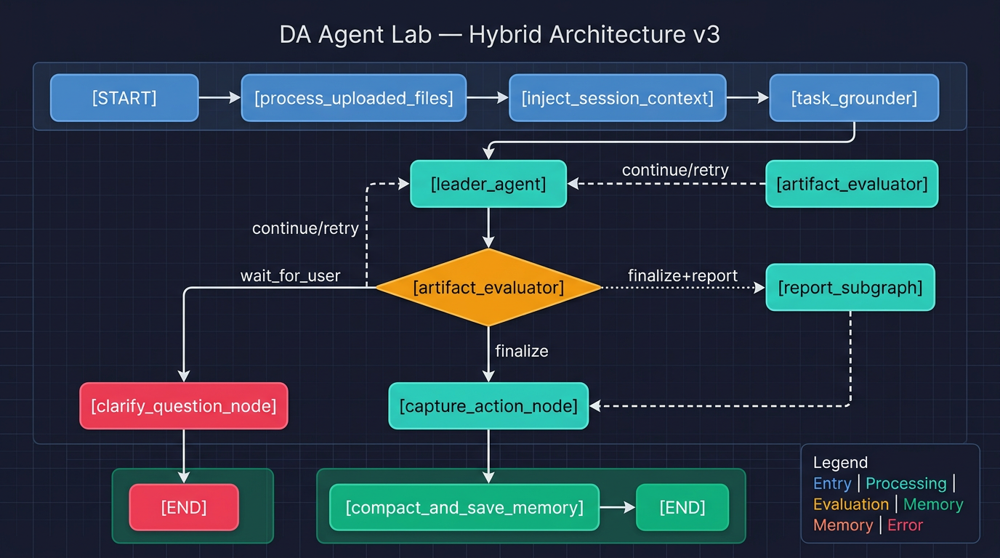

# docs — DA Agent Lab Documentation

> **Nguồn chân lý**: Mọi tài liệu phải **đúng với code hiện tại**. Nếu code thay đổi — cập nhật docs ngay.

---

## Architecture Overview

**10-node graph**, 3 routing decisions, 1 human-in-the-loop interrupt:

| Node | Type | Responsibility |
|------|------|---------------|
| `process_uploaded_files` | Tool | Parse file uploads, register tables |
| `inject_session_context` | Memory | Load conversation history via `thread_id` |
| `task_grounder` | Classifier | LLM (mini) → `TaskProfile` (mode, source, capabilities, confidence) |
| `leader_agent` | Supervisor | 5-step tool-calling loop — SQL, RAG, viz, report |
| `artifact_evaluator` | Evaluator | Deterministic: finalize / continue / retry / **wait_for_user** |
| `clarify_question_node` | Interrupt | Halt → show `[CLARIFY]` question → **END** (no memory save) |
| `capture_action_node` | Memory | Save `last_action`, `conversation_turn` |
| `compact_and_save_memory` | Memory | Persist to SQLite session store |
| `report_subgraph` | Subgraph | 4-phase: plan → execute → write → critique |

**Clarify interrupt**: khi `task_profile.confidence == "low"` hoặc `task_mode == "ambiguous"`, graph dừng tại `clarify_question_node` và chờ user input. Câu hỏi được generate tự động bằng heuristic tiếng Việt.

---

## Thư mục

### `thangquang09/` — Thắng & Phỏng vấn viên
**Ngôn ngữ:** Tiếng Việt · **Quy tắc:** Ghi WHY + HOW, không ghi WHAT

| File | Nội dung |
|------|----------|
| [01_architecture.md](thangquang09/01_architecture.md) | Sơ đồ khối chi tiết, Task Grounder, Artifact Evaluator, Routing decisions |
| [02_system_design.md](thangquang09/02_system_design.md) | Token economy, latency analysis, scalability, failure taxonomy |
| [03_interview_qna.md](thangquang09/03_interview_qna.md) | Trả lời hóc búa: LangGraph vs LC, hybrid decisions, SQL safety, observability |

### `_tech_specs/` — Tài liệu kỹ thuật chi tiết
**Ngôn ngữ:** English · **Quy tắc:** Precise types, real function signatures, field names

| File | Nội dung |
|------|----------|
| [01_state_model.md](_tech_specs/01_state_model.md) | `AgentState` complete schema — 7 nhóm field, Annotated merge semantics |
| [02_worker_contracts.md](_tech_specs/02_worker_contracts.md) | `WorkerArtifact` contract — artifact_type, status, terminal, recommended_action |
| [03_observability.md](_tech_specs/03_observability.md) | `RunTracer`, `@trace_node`, Langfuse, JSONL format |
| [04_observability_schema.md](_tech_specs/04_observability_schema.md) | Trace event schema, error tracking |

---

## Đọc nhanh theo vai trò

| Vai trò | Đọc |
|---------|------|
| Phỏng vấn viên | `thangquang09/01_architecture.md` → `thangquang09/03_interview_qna.md` |
| Review code mới | `_tech_specs/01_state_model.md` + `_tech_specs/02_worker_contracts.md` |
| Debug production | `_tech_specs/03_observability.md` |
| Thay đổi kiến trúc | `thangquang09/01_architecture.md` → `_tech_specs/01_state_model.md` |

---

## Source of truth

- **Graph flow**: `app/graph/graph.py` → `build_sql_v3_graph()`
- **State model**: `app/graph/state.py` → `AgentState`, `TaskProfile`, `WorkerArtifact`
- **Nodes**: `app/graph/nodes.py`
- **Workers**: `app/graph/standalone_visualization.py`, `app/tools/retrieve_rag_answer.py`
- **Observability**: `app/observability/tracer.py`
- **Prompts**: `app/prompts/task_grounder.py`, `app/prompts/leader.py`

## Quy tắc

1. **Code thay đổi → docs cập nhật ngay**. Không có aspirational docs.
2. Mỗi folder con có `AGENTS.md` / `CLAUDE.md` mô tả phạm vi.
3. File mới đặt tên rõ ràng: `YYYY-MM-DD_topic.md` cho research notes.
4. Không quét toàn bộ `docs/` nếu không cần — đọc đúng file.
