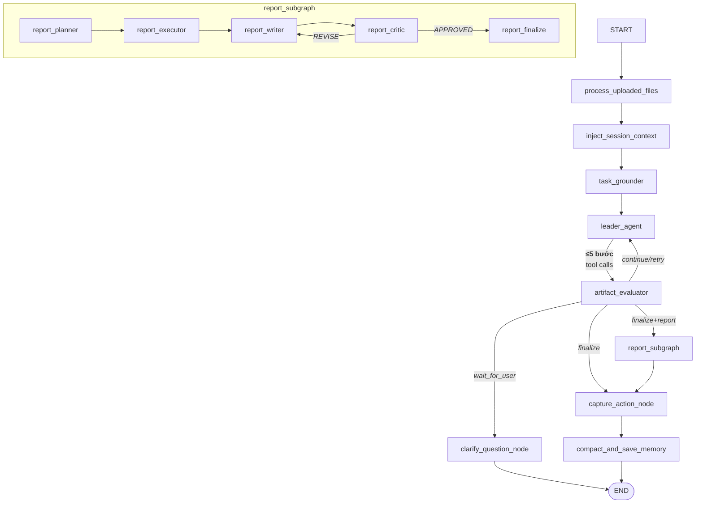
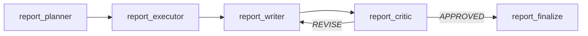

# Kiến trúc DA Agent Lab — Architecture v3

> **Nguồn**: Đọc trực tiếp từ code. `graph.py`, `nodes.py`, `state.py`, `task_grounder.py`, `standalone_visualization.py`, `report_subgraph.py`

---

## 1. Tổng quan

DA Agent Lab là LangGraph-based Data Analyst Agent. Nhận câu hỏi business/data, tự động chọn và thực thi tool (SQL, RAG, Visualization, Report), rồi tổng hợp câu trả lời có sức cân.

Đặc điểm chính:
- **Leader-first**: Leader agent điều phối 5 worker tools qua tool-calling loop (max 5 bước).
- **Artifact-based evaluation**: Tất cả worker output chuẩn hóa thành `WorkerArtifact`; artifact_evaluator quyết định finalize/continue/wait_for_user.
- **Constrained agent**: LLM chỉ gọi tool trong surface đã định nghĩa.
- **Full observability**: Mỗi node được instrument; trace ghi JSONL + Langfuse.

---

## 2. Entry Flow

```
START → process_uploaded_files → inject_session_context → task_grounder
  → leader_agent (tool-calling loop, max 5 bước)
  → artifact_evaluator
  → Routing:
      continue/retry  → leader_agent (loop back)
      wait_for_user   → clarify_question_node → END
      finalize+report  → report_subgraph
      finalize         → capture_action_node → compact_and_save_memory → END
```

---

## 3. Graph Architecture (Mermaid)




### 9 nodes chính

| Node | File | Obs type | Vai trò |
|------|------|----------|---------|
| `process_uploaded_files` | `nodes.py` | `tool` | Parse CSV/Excel, đăng ký bảng tạm |
| `inject_session_context` | `nodes.py` | `memory` | Gắn thread_id, session_context |
| `task_grounder` | `task_grounder.py` | `agent` | Phân loại query → `TaskProfile` |
| `leader_agent` | `nodes.py:1535` | `agent` | Tool-calling loop 5 bước |
| `artifact_evaluator` | `nodes.py:1023` | `agent` | Deterministic eval của artifacts |
| `clarify_question_node` | `nodes.py:878` | `memory` | Interrupt, hỏi user làm rõ |
| `report_subgraph` | `report_subgraph.py` | subgraph | planning→execution→writing→critique |
| `capture_action_node` | `nodes.py` | `memory` | Ghi nhận final action |
| `compact_and_save_memory` | `nodes.py` | `memory` | Tóm tắt + lưu memory |

---

## 4. Task Grounder

**File**: `app/graph/task_grounder.py`

Gọi LLM nhẹ (`model_preclassifier` = `gpt-4o-mini`) phân loại câu hỏi thành `TaskProfile`:

```python
class TaskProfile(TypedDict):
    task_mode: Literal["simple", "mixed", "ambiguous"]
    data_source: Literal["inline_data", "uploaded_table", "database", "knowledge", "mixed"]
    required_capabilities: list[Literal["sql", "rag", "visualization", "report"]]
    followup_mode: Literal["fresh_query", "followup", "refine_previous_result"]
    confidence: Literal["high", "medium", "low"]
    reasoning: str
```

Dùng bởi `leader_agent` (chọn tool) và `artifact_evaluator` (check coverage).

---

## 5. Leader Agent

**File**: `app/graph/nodes.py:1535`

Tool-calling loop 5 bước (max). Mỗi bước: LLM trả `{action, tool, args, reason}` → dispatch worker → wrap thành `WorkerArtifact` → update scratchpad.

### 5 tools leader gọi được

| Tool | Worker | artifact_type | Đặc điểm |
|------|--------|--------------|----------|
| `ask_sql_analyst` | `ask_sql_analyst_tool()` | `sql_result` | SQL đơn lẻ |
| `ask_sql_analyst_parallel` | `ask_sql_analyst_parallel_tool()` | `sql_result` | Fan-out ThreadPoolExecutor, aggregate |
| `retrieve_rag_answer` | `retrieve_rag_answer()` | `rag_context` | Vector search |
| `create_visualization` | `inline_data_worker()` | `chart` | Không SQL/DB; inline data → E2B sandbox |
| `generate_report` | (report_subgraph) | — | Trigger report pipeline |

Khi `action="final"` → leader trả `final_answer` trực tiếp, không qua evaluator.

---

## 6. WorkerArtifact Schema

```python
class WorkerArtifact(TypedDict):
    artifact_type: Literal["sql_result", "rag_context", "chart", "report_draft"]
    status: Literal["success", "failed", "partial"]
    payload: dict       # Kết quả thực tế của worker
    evidence: dict      # Metadata: row_count, retrieved_chunks, etc.
    terminal: bool      # True = có thể finalize ngay
    recommended_next_action: Literal["finalize", "visualize", "retry_sql",
                                      "ask_rag", "clarify", "none"]
```

### Worker implementations

| Worker | File:Line | Đặc điểm |
|--------|-----------|----------|
| `ask_sql_analyst_tool` | `nodes.py` | generate → validate → execute → analyze |
| `ask_sql_analyst_parallel_tool` | `nodes.py:1396` | Fan-out, ThreadPoolExecutor, aggregate |
| `inline_data_worker` | `standalone_visualization.py:44` | **Không SQL/DB**. LLM generate Python code → execute trên E2B sandbox → extract PNG |
| `retrieve_rag_answer` | `tools/retrieve_rag_answer.py` | Vector search, top_k chunks |

---

## 7. Artifact Evaluator

**File**: `app/graph/nodes.py:918` (`_evaluate_artifacts`)

**Deterministic** (không gọi LLM). Check theo thứ tự:

```
1. Terminal artifact present?  → finalize
2. Failed artifact + retry flag?  → retry
3. All required capabilities covered?  → finalize
4. task_mode="ambiguous" OR confidence="low"?  → wait_for_user
5. Otherwise  → continue (missing types)
```

### Capability → artifact mapping

```python
CAPABILITY_TO_TYPE = {
    "sql": "sql_result", "rag": "rag_context",
    "visualization": "chart", "report": "report_draft",
}
```

### Routing

```python
def _route_after_leader(state):
    decision = state["artifact_evaluation"]["decision"]
    if decision in ("continue", "retry"): return "leader_agent"
    if decision == "wait_for_user": return "clarify_question_node"
    if state.get("response_mode") == "report": return "report_subgraph"
    return "capture_action_node"
```

---

## 8. Clarify Interrupt

**File**: `app/graph/nodes.py:878`

Khi evaluator trả `decision="wait_for_user"`:

1. `clarify_question_node` sinh câu hỏi dựa trên `task_mode`, `data_source`, `confidence`
2. Câu trả lời prefix `[CLARIFY]` để frontend phân biệt interrupt
3. Graph đi ra `END` — user response xử lý bên ngoài

Câu hỏi sinh theo logic:
- `task_mode="ambiguous"` + `data_source="mixed"` → hỏi DB/file/tài liệu?
- `confidence="low"` → hỏi diễn đạt lại
- `missing` capabilities → liệt kê thiếu gì

---

## 9. Report Subgraph

**File**: `app/graph/report_subgraph.py`

Trigger khi `leader_agent` gọi `generate_report`.



| Node | Model | Vai trò |
|------|-------|---------|
| `report_planner_node` | `model_report_planner` | Lên kế hoạch sections |
| `report_executor_node` | — | Fan-out SQL tasks (max 4 threads) |
| `report_writer_node` | `model_report_writer` | Viết markdown từ section results |
| `report_critic_node` | `model_report_critic` | Critique report, quyết revise/approve |
| `report_finalize_node` | — | Gắn final_markdown vào answer |

Critic loop: **tối đa 2 revise**, hash detect change.

---

## 10. Observability

**Files**: `app/observability/tracer.py`, `app/observability/schemas.py`

Mỗi node wrap bởi `_instrument_node` (`graph.py:22`):

```python
def _instrument_node(node_name, fn, observation_type):
    def _wrapped(state):
        tracer = get_current_tracer()
        scope = tracer.start_node(node_name=node_name,
                                   state=state,
                                   observation_type=observation_type)
        update = fn(state)
        tracer.end_node(scope, update=update)
        return update
    return _wrapped
```

Mỗi run capture: `run_id`, `thread_id`, routing decision, `tool_history`, `validated_sql`, latency, errors, token usage + cost. Output: **JSONL** (replayable) + **Langfuse** qua `get_current_tracer()`.

---

## 11. State Model

`AgentState` nhóm theo lifecycle:

| Nhóm | Fields | Nguồn |
|------|--------|-------|
| **Input** | `user_query`, `target_db_path`, `uploaded_files`, `uploaded_file_data` | GraphInputState |
| **Context** | `schema_context`, `xml_database_context`, `session_context`, `thread_id` | inject_session_context |
| **Grounding** | `task_profile: TaskProfile`, `intent`, `confidence` | task_grounder |
| **Execution** | `artifacts: list[WorkerArtifact]`, `task_results`, `visualization`, `response_mode` | leader_agent, workers |
| **Output** | `final_answer`, `final_payload: AnswerPayload`, `report_*` | synthesize, report_subgraph |
| **Memory** | `conversation_turn`, `last_action`, `result_ref` | memory nodes |
| **Observability** | `run_id`, `step_count`, `tool_history`, `errors` | all nodes |

### Config models

| Field | Ý nghĩa |
|-------|---------|
| `model_preclassifier` | Task grounder (`gpt-4o-mini`) |
| `model_leader` | Leader agent LLM |
| `model_synthesis` | Visualization code gen, report writer |
| `model_report_planner` | Report planning |
| `model_report_critic` | Report critique |

---

> Document phản ánh codebase thực tế tại thời điểm viết. Tham chiếu line numbers trong source files để verify.
