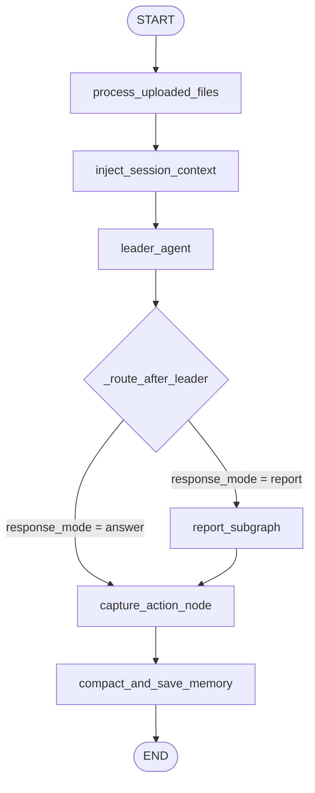
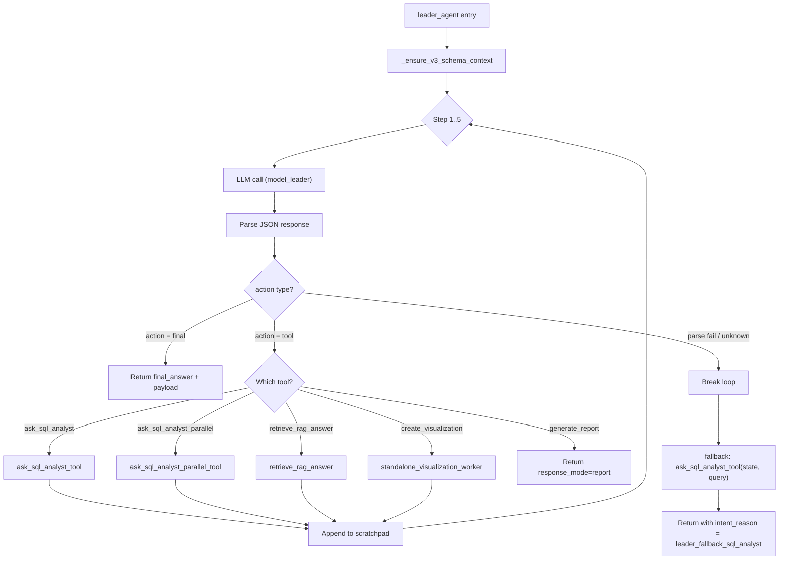

# Current Architecture — DA Agent Lab v3

> Last updated: 2026-04-05

## Overview

DA Agent Lab v3 uses a **leader-centered supervisor pattern** built on LangGraph `StateGraph`. The leader agent orchestrates high-level tools in a multi-step loop, with tool results summarized into a scratchpad that the leader reads on each subsequent step.

---

## Entry Point

```text
User (CLI / Streamlit / FastAPI)
  │
  ▼
run_query()                          ← app/main.py
  │
  ├─ build_sql_v3_graph()           ← app/graph/graph.py
  ├─ RunTracer(run_id, thread_id)   ← app/observability/tracer.py
  │
  ▼
graph.invoke(input, config)
```

`run_query()` creates a fresh graph per call, initializes the tracer, and invokes the LangGraph state machine synchronously. The FastAPI backend wraps this in `asyncio.run_in_executor()` to avoid blocking.

---

## Graph Topology

The v3 graph has **6 nodes** connected in a mostly linear chain, with one conditional branch for reports:



### Node → Function → File mapping

| Node name | Function | File | Observation type |
|---|---|---|---|
| `process_uploaded_files` | `process_uploaded_files()` | `app/graph/nodes.py:575` | tool |
| `inject_session_context` | `inject_session_context()` | `app/graph/nodes.py:1497` | memory |
| `leader_agent` | `leader_agent()` | `app/graph/nodes.py:1197` | agent |
| `report_subgraph` | `build_report_subgraph()` | `app/graph/report_subgraph.py` | subgraph |
| `capture_action_node` | `capture_action_node()` | `app/graph/nodes.py:1816` | memory |
| `compact_and_save_memory` | `compact_and_save_memory()` | `app/graph/nodes.py` | memory |

Each node is wrapped by `_instrument_node()` (in `app/graph/graph.py:18`) for JSONL + Langfuse tracing, and decorated with `@trace_node()` (in `app/debug.py:74`) for DEBUG file logging.

---

## Leader Agent Internals

The leader is the core orchestrator. It runs a **5-step ReAct-style loop** with a JSON-only prompt:



### Key observations

1. **Scratchpad accumulation**: After each tool call, `_summarize_tool_result()` produces a compact JSON summary that gets appended to `scratchpad_entries`. The next LLM call sees all previous tool results.

2. **Universal SQL fallback**: If the leader exhausts 5 steps without emitting `{"action": "final"}`, the code at line 1445 calls `ask_sql_analyst_tool()` as a last resort — regardless of whether the query is about SQL, visualization, or anything else.

3. **Tool results are semi-final**: `ask_sql_analyst_tool()` already generates a natural-language `answer_summary` internally. The leader often just wraps this as-is, blurring the boundary between tool execution and final answer composition.

---

## Worker Subgraphs

### SQL Worker (`sql_worker_graph`)

Located in `app/graph/sql_worker_graph.py`. A nested LangGraph subgraph with nodes:

```text
generate_sql → validate_sql → execute_sql → [generate_visualization] → END
```

- SQL generation uses `model_sql_generation` (typically gpt-4o)
- Validation uses regex-based patterns in `app/tools/validate_sql.py`
- Visualization is conditional, triggered by `requires_visualization` flag

### Standalone Visualization Worker

Located in `app/graph/standalone_visualization.py`. Handles inline data (user-provided numbers):

```text
raw_data → _generate_standalone_visualization_code() → E2B sandbox execution → image extraction
```

### Report Subgraph

Located in `app/graph/report_subgraph.py`. Multi-step report pipeline:

```text
report_planner → report_executor (parallel SQL sections) → report_writer → report_critic → report_finalize
```

---

## State Model

The global state (`AgentState` in `app/graph/state.py`) is a `TypedDict` with **60+ fields** spanning:

| Group | Example fields | Count |
|---|---|---|
| Input | `user_query`, `uploaded_file_data`, `thread_id` | ~6 |
| Schema/context | `schema_context`, `xml_database_context`, `table_contexts` | ~6 |
| Intent/routing | `intent`, `intent_reason`, `execution_mode`, `context_type` | ~5 |
| SQL execution | `generated_sql`, `validated_sql`, `sql_result`, `sql_retry_count` | ~5 |
| Task plan/execute | `task_plan`, `task_results`, `aggregate_analysis` | ~3 |
| Output | `final_answer`, `final_payload`, `visualization`, `result_ref` | ~5 |
| Memory | `session_context`, `last_action`, `conversation_turn` | ~3 |
| Report | `report_plan`, `report_sections`, `report_draft`, `critic_*` | ~8 |
| Observability | `run_id`, `tool_history`, `errors`, `step_count`, `confidence` | ~5 |
| Other | `expected_keywords`, `needs_semantic_context`, `file_cache` | ~5 |

All fields live in a single flat `TypedDict` — there is no hierarchical grouping.

---

## Observability Stack

Three layers of tracing run simultaneously:

| Layer | Location | Output | Purpose |
|---|---|---|---|
| JSONL trace | `app/observability/tracer.py` | `traces/trace.jsonl` | Structured run/node records for eval |
| Langfuse | `app/observability/tracer.py` (adapter) | Langfuse cloud | Production monitoring |
| Debug log | `app/debug.py` + `app/logger.py` | `logs/DEBUG.log` | Developer troubleshooting |

The JSONL tracer and Langfuse adapter are wired via `_instrument_node()` in `graph.py`. The debug log uses the `@trace_node()` decorator applied directly to node functions.

---

## Known Architectural Issues

| Issue | Root cause | Impact |
|---|---|---|
| Inline data queries fall back to SQL | Universal SQL fallback at `nodes.py:1445` | Visualization-only queries get SQL errors |
| Quoted CTE names rejected | Regex-based validator misses `"Data"` as CTE | Valid SQL marked as "Unknown table" |
| Tool output blurs with final answer | `ask_sql_analyst_tool()` returns `answer_summary` | Leader role reduced to pass-through |
| No terminal signal from tools | Tool results lack `terminal` flag | Leader cannot reliably decide when to stop |
| State bloat | 60+ flat fields, many duplicated with `TaskState` | Hard to trace, debug, and extend |
| Session memory can bias routing | `last_action` from previous turn influences current | Inline data query inherits SQL intent |

---

## File Index

| File | Role |
|---|---|
| `app/main.py` | Entry point, graph invocation, tracer lifecycle |
| `app/graph/graph.py` | Graph builder, node wiring, conditional edges |
| `app/graph/state.py` | `AgentState`, `TaskState`, `AnswerPayload`, `GraphOutputState` |
| `app/graph/nodes.py` | All main graph nodes + leader agent + SQL tools |
| `app/graph/edges.py` | Routing functions (legacy v2 + v3) |
| `app/graph/sql_worker_graph.py` | SQL worker subgraph |
| `app/graph/standalone_visualization.py` | Inline data visualization worker |
| `app/graph/report_subgraph.py` | Report generation pipeline |
| `app/graph/continuity.py` | Follow-up query detection |
| `app/tools/validate_sql.py` | SQL validation (regex-based) |
| `app/prompts/leader.py` | Leader system prompt |
| `app/prompts/preclassifier.py` | Preclassifier prompt |
| `app/observability/tracer.py` | JSONL + Langfuse tracing |
| `app/debug.py` | `@trace_node` decorator, debug log filtering |
| `app/memory/conversation_store.py` | SQLite conversation memory |
