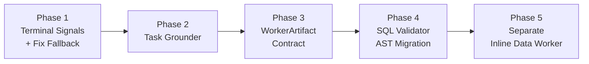
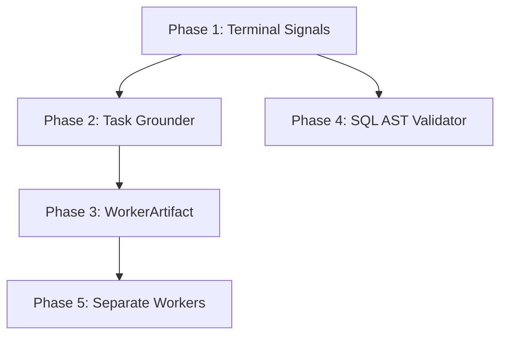

# Migration Plan — v3 to Hybrid Architecture

> Last updated: 2026-04-05

## Phasing Strategy

Each phase is designed to be **independently shippable** — the system remains functional after each phase. Phases are ordered by impact-to-effort ratio: the first two phases fix the bugs discovered in testing, while later phases improve long-term extensibility.



---

## Phase 1 — Terminal Signals + Remove Global SQL Fallback

### Goal

Fix the immediate bugs: visualization-only queries falling through to SQL, and the leader never stopping after a successful `create_visualization` call.

### What changes

1. **Add `terminal` and `recommended_next_action` to tool results**

   In `leader_agent()`, after each tool call completes, check if the tool result signals completion:

   ```python
   # After create_visualization succeeds
   if tool_name == "create_visualization" and tool_result.get("status") == "success":
       viz = tool_result.get("visualization", {})
       if viz.get("success"):
           # Auto-finalize — don't wait for leader LLM to decide
           return {
               "final_answer": "...",  # composed from viz metadata
               "visualization": viz,
               ...
               "intent_reason": "visualization_auto_finalize",
           }
   ```

2. **Replace universal SQL fallback with domain-aware fallback**

   Current fallback at `nodes.py:1445`:
   ```python
   # CURRENT: always falls back to SQL
   fallback_result = ask_sql_analyst_tool(state, query)
   ```

   Replace with:
   ```python
   # PROPOSED: fallback depends on what tools were already attempted
   if "create_visualization" in used_high_level_tools:
       return _visualization_fallback_response(state, sql_artifacts)
   elif "retrieve_rag_answer" in used_high_level_tools:
       return _rag_fallback_response(state)
   else:
       fallback_result = ask_sql_analyst_tool(state, query)
       ...
   ```

3. **Update `_summarize_tool_result()` for `create_visualization`**

   Ensure the scratchpad entry for a successful visualization clearly signals that the task is complete, so even if the leader LLM doesn't auto-finalize, it has strong signal to emit `{"action": "final"}`.

### Affected files

| File | Change |
|---|---|
| `app/graph/nodes.py` | `leader_agent()` — add terminal check after `create_visualization`; replace fallback logic |
| `app/graph/standalone_visualization.py` | Add `terminal: True` to success response |

### Tests to add

| Test case | Validates |
|---|---|
| `test_inline_data_visualization_does_not_fallback_to_sql` | "Vẽ biểu đồ tròn cho 10, 30, 60" -> `used_tools == ["create_visualization"]`, no SQL errors |
| `test_visualization_success_auto_finalizes` | Viz success -> `intent_reason != "leader_fallback_sql_analyst"` |
| `test_sql_query_still_uses_sql_fallback` | Normal SQL query -> fallback still works for SQL-typed queries |

### Risk

Low. Changes are localized to the leader function. Existing SQL paths are untouched unless visualization was attempted first.

---

## Phase 2 — Task Grounder Node

### Goal

Add a lightweight classification step between `inject_session_context` and `leader_agent` that produces a structured `TaskProfile`. This gives the supervisor typed context instead of guessing from raw text.

### What changes

1. **New `TaskProfile` TypedDict** in `app/graph/state.py`:

   ```python
   class TaskProfile(TypedDict):
       task_mode: Literal["simple", "mixed", "ambiguous"]
       data_source: Literal["inline_data", "uploaded_table", "database", "knowledge", "mixed"]
       required_capabilities: list[Literal["sql", "rag", "visualization", "report"]]
       followup_mode: Literal["fresh_query", "followup", "refine_previous_result"]
       confidence: Literal["high", "medium", "low"]
   ```

2. **New prompt** `app/prompts/task_grounder.py` — system prompt that returns JSON matching `TaskProfile`.

3. **New node function** `task_grounder_node()` — a single LLM call using `model_preclassifier` (gpt-4o-mini). Lives in `app/graph/nodes.py` or a new `app/graph/task_grounder.py`.

4. **Wire into graph** in `app/graph/graph.py`:
   ```python
   builder.add_edge("inject_session_context", "task_grounder")
   builder.add_edge("task_grounder", "leader_agent")
   ```

5. **Leader reads `task_profile`** — the supervisor prompt includes `task_profile` as structured context, reducing ambiguity.

### Affected files

| File | Change |
|---|---|
| `app/graph/state.py` | Add `TaskProfile`, add `task_profile` field to `AgentState` |
| `app/prompts/task_grounder.py` | New file — grounder prompt definition |
| `app/prompts/manager.py` | Add `task_grounder_messages()` method |
| `app/graph/nodes.py` or new file | Add `task_grounder_node()` function |
| `app/graph/graph.py` | Wire new node between `inject_session_context` and `leader_agent` |
| `app/prompts/leader.py` | Include `task_profile` in leader prompt template |

### Relationship to existing preclassifier

The current preclassifier (`app/prompts/preclassifier.py`) routes to `data | meta | unsafe | clarify`. The Task Grounder **replaces and extends** it:

| Preclassifier | Task Grounder |
|---|---|
| `data` | `task_mode` + `data_source` + `required_capabilities` |
| `meta` | `task_mode = meta` (direct response) |
| `unsafe` | `task_mode = unsafe` (refuse) |
| `clarify` | `task_mode = ambiguous` + `confidence = low` |

### Tests to add

| Test case | Validates |
|---|---|
| `test_grounder_inline_data_returns_visualization` | Numbers in query -> `data_source=inline_data`, `required_capabilities=[visualization]` |
| `test_grounder_sql_query_returns_database` | Data question about table -> `data_source=database`, `required_capabilities=[sql]` |
| `test_grounder_mixed_query_returns_multiple_capabilities` | Mixed query -> `required_capabilities=[sql, rag, visualization]` |
| `test_grounder_meta_query_short_circuits` | "Bạn có thể làm gì?" -> does not reach leader |

### Risk

Medium. Adds a new LLM call (~500ms with gpt-4o-mini). Can be mitigated by making it conditional (skip if query is clearly simple SQL).

---

## Phase 3 — Standardize WorkerArtifact Contract

### Goal

All workers return the same typed schema. The supervisor and evaluator consume artifacts instead of ad-hoc dicts with different shapes per tool.

### What changes

1. **Define `WorkerArtifact`** in `app/graph/state.py`:

   ```python
   class WorkerArtifact(TypedDict):
       artifact_type: Literal["sql_result", "rag_context", "chart", "report_draft"]
       status: Literal["success", "failed", "partial"]
       payload: dict[str, Any]
       evidence: dict[str, Any]
       terminal: bool
       recommended_next_action: Literal[
           "finalize", "visualize", "retry_sql", "ask_rag", "clarify", "none"
       ]
   ```

2. **Add `artifacts` field** to `AgentState`:
   ```python
   artifacts: Annotated[list[WorkerArtifact], operator.add]
   ```

3. **Refactor `ask_sql_analyst_tool()`** to wrap its return in `WorkerArtifact`.

4. **Refactor `standalone_visualization_worker()`** to return `WorkerArtifact`.

5. **Refactor `retrieve_rag_answer()`** to return `WorkerArtifact`.

6. **Add `_evaluate_artifacts()` function** — deterministic check of artifact sufficiency. Called by supervisor between steps.

7. **Update leader prompt** to present artifacts as structured context instead of scratchpad.

### Affected files

| File | Change |
|---|---|
| `app/graph/state.py` | Add `WorkerArtifact`, add `artifacts` to `AgentState` |
| `app/graph/nodes.py` | Refactor `ask_sql_analyst_tool()`, add `_evaluate_artifacts()` |
| `app/graph/standalone_visualization.py` | Return `WorkerArtifact` |
| `app/tools/rag.py` (or equivalent) | Return `WorkerArtifact` |
| `app/prompts/leader.py` | Update template to include typed artifact summaries |
| `app/debug.py` | Add `artifacts` to `_FILTERED_KEYS` |

### Migration strategy

Use an adapter pattern: each worker internally produces its natural output, then wraps it in `WorkerArtifact` at the boundary. This avoids rewriting worker internals.

### Tests to add

| Test case | Validates |
|---|---|
| `test_sql_worker_returns_worker_artifact` | Return matches `WorkerArtifact` schema |
| `test_viz_worker_returns_worker_artifact` | Return matches `WorkerArtifact` schema |
| `test_evaluate_artifacts_detects_completion` | `terminal=true` -> evaluator says done |
| `test_evaluate_artifacts_detects_missing_capability` | SQL done but viz needed -> evaluator says continue |

### Risk

Medium-high. Touches multiple worker functions. Use adapter pattern to minimize blast radius.

---

## Phase 4 — SQL Validator AST Migration

### Goal

Replace regex-based SQL parsing in `validate_sql.py` with AST-based parsing using `sqlglot`. This fixes the quoted identifier bug (`WITH "Data" AS ...`) and makes validation more robust for complex queries.

### What changes

1. **Add `sqlglot` dependency** to `pyproject.toml`.

2. **Replace `_extract_cte_names()` and `TABLE_TOKEN_PATTERN`** with AST-based extraction:

   ```python
   import sqlglot

   def _extract_tables_and_ctes(sql: str) -> tuple[set[str], set[str]]:
       """Return (referenced_tables, defined_cte_names) using AST parsing."""
       try:
           parsed = sqlglot.parse_one(sql, read="postgres")
           cte_names = {
               cte.alias.lower()
               for cte in parsed.find_all(sqlglot.exp.CTE)
           }
           table_refs = {
               table.name.lower()
               for table in parsed.find_all(sqlglot.exp.Table)
           }
           return table_refs, cte_names
       except sqlglot.errors.ParseError:
           # Fallback to regex for unparseable SQL
           return _regex_extract_tables(sql), _extract_cte_names_regex(sql)
   ```

3. **Replace `FORBIDDEN_SQL_PATTERNS` regex** with AST statement type checking:
   ```python
   stmt_type = type(parsed).__name__
   if stmt_type not in ("Select",):
       reasons.append("Only SELECT queries are allowed.")
   ```

4. **Keep regex as fallback** for edge cases where `sqlglot` cannot parse.

### Affected files

| File | Change |
|---|---|
| `pyproject.toml` | Add `sqlglot` dependency |
| `app/tools/validate_sql.py` | Replace regex extraction with AST; keep regex fallback |

### Tests to add

| Test case | Validates |
|---|---|
| `test_validate_sql_quoted_cte_name` | `WITH "Data" AS (...) SELECT ... FROM "Data"` -> valid |
| `test_validate_sql_chained_ctes` | Multiple CTEs with quoted names -> valid |
| `test_validate_sql_rejects_insert` | `INSERT INTO ...` -> rejected by AST check |
| `test_validate_sql_falls_back_to_regex` | Malformed SQL -> regex fallback produces result |
| `test_validate_sql_subquery_tables` | Subquery `FROM` refs resolved correctly |

### Risk

Low. `sqlglot` is a well-maintained library. Regex fallback ensures no regression on edge cases.

---

## Phase 5 — Separate Inline Data Worker from DB SQL Worker

### Goal

Inline data queries (user provides numbers directly) should never enter the SQL worker pipeline or hit the SQL validator against real database tables.

### What changes

1. **Supervisor routes based on `TaskProfile.data_source`**:
   - `inline_data` -> `InlineDataWorker` (visualization-focused)
   - `database` / `uploaded_table` -> `SQLWorker` (query-focused)

2. **`InlineDataWorker`** is a cleaned-up version of `standalone_visualization_worker()` that:
   - Accepts raw data directly from the query
   - Never generates SQL
   - Never calls `validate_sql()`
   - Returns `WorkerArtifact` with `artifact_type="chart"`

3. **`SQLWorker`** remains as-is (the current `sql_worker_graph` subgraph), but only receives database-backed queries.

4. **Remove inline data handling from leader's `create_visualization` branch** — the regex number extraction at `nodes.py:1363-1375` moves into `InlineDataWorker`.

### Affected files

| File | Change |
|---|---|
| `app/graph/nodes.py` | Remove inline data regex from `create_visualization` branch |
| `app/graph/standalone_visualization.py` | Evolve into `InlineDataWorker` |
| `app/graph/state.py` | Add `inline_data` to relevant type definitions |

### Tests to add

| Test case | Validates |
|---|---|
| `test_inline_data_never_hits_sql_validator` | "Vẽ biểu đồ cho 10, 20, 30" -> no `validate_sql` call |
| `test_inline_data_with_uploaded_table_in_session` | Inline data query while table exists -> uses InlineDataWorker, not SQL |
| `test_db_query_still_uses_sql_worker` | Normal SQL question -> uses SQLWorker as before |

### Risk

Low. This is mostly code organization. The inline data path already exists; it just needs to be cleanly separated from the SQL path.

---

## Phase Dependencies



- **Phase 1** is prerequisite for everything — it fixes the immediate bugs.
- **Phase 2** depends on Phase 1 (grounder needs terminal signals to be meaningful).
- **Phase 3** depends on Phase 2 (artifacts need task profile context).
- **Phase 4** is independent — can run in parallel with Phase 2/3.
- **Phase 5** depends on Phase 3 (worker separation uses artifact contract).

---

## Estimated Effort

| Phase | Scope | Estimated effort |
|---|---|---|
| Phase 1 | 2 files, ~50 lines changed | 1-2 hours |
| Phase 2 | 5-6 files, ~200 lines new | 3-4 hours |
| Phase 3 | 5-6 files, ~150 lines changed | 3-4 hours |
| Phase 4 | 2 files, ~100 lines changed | 2-3 hours |
| Phase 5 | 3 files, ~100 lines moved/reorganized | 2-3 hours |

Total: ~12-16 hours of focused implementation.

---

## Rollback Strategy

Each phase can be reverted independently:

- **Phase 1**: Remove terminal check and restore original fallback. One function change.
- **Phase 2**: Remove `task_grounder` node from graph, remove edge. Graph reverts to direct `inject_session_context -> leader_agent`.
- **Phase 3**: Workers can return both old format and `WorkerArtifact` during transition (adapter pattern).
- **Phase 4**: `sqlglot` import can be wrapped in try/except with regex fallback always available.
- **Phase 5**: Inline data worker is additive — removing it routes inline data back through the original path.
