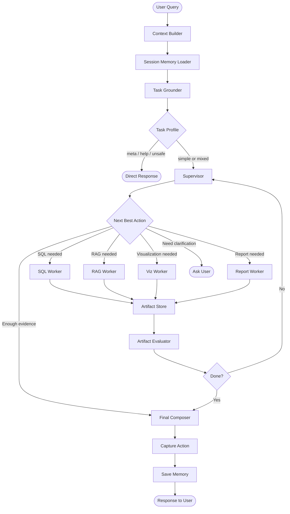
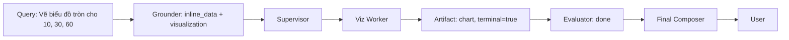
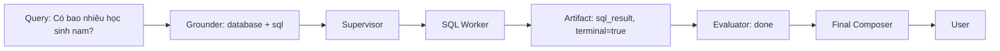
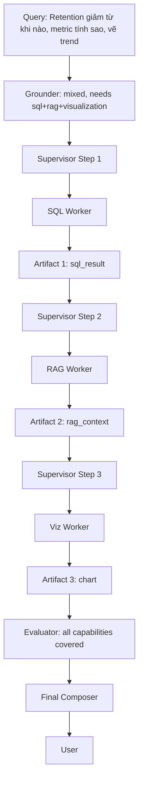
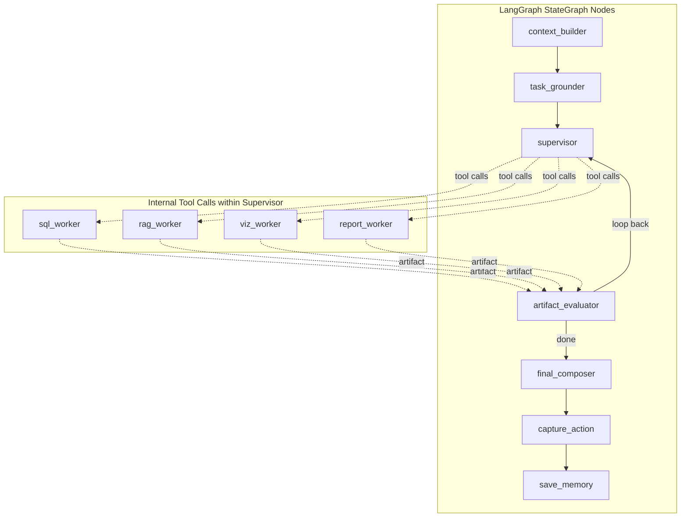

# Proposed Hybrid Architecture — DA Agent Lab v4

> Last updated: 2026-04-05

## Design Principles

1. **Grounding before orchestration** — A lightweight classifier determines the task profile before the supervisor starts planning. The supervisor never guesses data source or task type from raw text.

2. **Typed worker contracts** — Every worker returns a `WorkerArtifact` with explicit `terminal` and `recommended_next_action` fields. The supervisor reads structured artifacts, not free-form scratchpad text.

3. **Domain-specific fallbacks** — No universal SQL fallback. If a visualization worker fails, it retries visualization or returns an error — it never silently degrades into a SQL query.

4. **Single answer origin** — Only the Final Composer produces user-facing prose. Workers produce execution artifacts; the supervisor produces orchestration decisions.

5. **Clean state boundaries** — State fields are grouped by lifecycle phase. Worker-internal fields (retry counts, intermediate SQL) stay inside workers.

---

## Overall Flow



---

## Layer Descriptions

### 1. Context Builder

Merges the current `process_uploaded_files` and `inject_session_context` nodes. Responsibilities:

- Auto-register uploaded CSV files into the database
- Build `xml_database_context` from schema
- Load session memory (recent turns, summary, `last_action`)

**No changes needed** — this layer works well as-is.

### 2. Task Grounder (new)

A single lightweight LLM call (using `model_preclassifier` / gpt-4o-mini) that returns a structured `TaskProfile`:

```python
class TaskProfile(TypedDict):
    task_mode: Literal["simple", "mixed", "ambiguous"]
    data_source: Literal["inline_data", "uploaded_table", "database", "knowledge", "mixed"]
    required_capabilities: list[Literal["sql", "rag", "visualization", "report"]]
    followup_mode: Literal["fresh_query", "followup", "refine_previous_result"]
    confidence: Literal["high", "medium", "low"]
```

**Examples:**

| Query | task_mode | data_source | required_capabilities |
|---|---|---|---|
| "Vẽ biểu đồ tròn cho 10, 30, 60" | simple | inline_data | [visualization] |
| "Có bao nhiêu học sinh nam?" | simple | database | [sql] |
| "Retention D1 là gì?" | simple | knowledge | [rag] |
| "Retention giảm từ khi nào, metric tính sao, vẽ trend" | mixed | mixed | [sql, rag, visualization] |
| "Tạo báo cáo phân tích chi tiết" | simple | database | [report] |

**Key constraint:** The grounder does NOT plan execution order. It only identifies *what* is needed, not *how* to sequence it. Sequencing is the supervisor's job.

### 3. Supervisor (evolved leader_agent)

The supervisor reads `TaskProfile` + accumulated `WorkerArtifact` list to decide:

1. Which worker to call next
2. Whether enough evidence exists to finalize
3. Whether to ask for user clarification

**Differences from current `leader_agent`:**

| Aspect | Current | Proposed |
|---|---|---|
| Input context | Raw query + scratchpad text | `TaskProfile` + typed artifacts |
| Stop condition | LLM must emit `{"action": "final"}` | `terminal=true` in any artifact OR supervisor decision |
| Fallback | Universal SQL fallback | Domain-specific: retry same family or return error |
| Answer generation | Mixed into supervisor | Delegated to Final Composer |

The supervisor loop remains a multi-step LLM loop (up to N steps), but each step receives structured context instead of accumulated text.

### 4. Worker Family

Each worker is a self-contained execution unit. All workers return the same `WorkerArtifact` schema:

```python
class WorkerArtifact(TypedDict):
    artifact_type: Literal["sql_result", "rag_context", "chart", "report_draft"]
    status: Literal["success", "failed", "partial"]
    payload: dict[str, Any]       # worker-specific data
    evidence: dict[str, Any]      # source attribution
    terminal: bool                 # is this enough to answer the user?
    recommended_next_action: Literal[
        "finalize", "visualize", "retry_sql", "ask_rag", "clarify", "none"
    ]
```

#### Worker output examples

**SQL Worker — success:**
```json
{
  "artifact_type": "sql_result",
  "status": "success",
  "payload": {
    "rows": [{"gender": "male", "count": 482}, {"gender": "female", "count": 518}],
    "row_count": 2,
    "columns": ["gender", "count"]
  },
  "evidence": {
    "generated_sql": "SELECT gender, COUNT(*) ...",
    "validated_sql": "SELECT gender, COUNT(*) ...",
    "table": "Performance_of_Stuednts"
  },
  "terminal": true,
  "recommended_next_action": "finalize"
}
```

**Viz Worker — success with inline data:**
```json
{
  "artifact_type": "chart",
  "status": "success",
  "payload": {
    "image_data": "<base64>",
    "image_format": "png",
    "chart_type": "pie"
  },
  "evidence": {
    "source": "inline_data",
    "normalized_rows": [
      {"label": "Category 1", "value": 10},
      {"label": "Category 2", "value": 30},
      {"label": "Category 3", "value": 60}
    ]
  },
  "terminal": true,
  "recommended_next_action": "finalize"
}
```

**RAG Worker — partial:**
```json
{
  "artifact_type": "rag_context",
  "status": "partial",
  "payload": {
    "chunks": ["Retention D1 measures..."],
    "chunk_count": 1
  },
  "evidence": {
    "source": "rag_index",
    "query": "Retention D1 definition"
  },
  "terminal": false,
  "recommended_next_action": "finalize"
}
```

### 5. Artifact Evaluator (new)

A deterministic (non-LLM) function that checks:

| Check | Logic |
|---|---|
| All `required_capabilities` covered? | Compare `TaskProfile.required_capabilities` against collected artifact types |
| Any artifact failed? | If failed and `recommended_next_action` is retry, loop back |
| Terminal artifact present? | If `terminal=true`, can proceed to finalize |
| Max steps exceeded? | If step count > limit, force finalize with partial results |

The evaluator does NOT use LLM — it's pure logic based on artifact metadata.

### 6. Final Composer (extracted)

A dedicated LLM call that takes:
- Original user query
- All collected `WorkerArtifact` payloads
- `TaskProfile` for context

And produces:
- Natural language answer in the user's language
- Properly attributed evidence
- Confidence assessment

This is the **only place** that generates user-facing prose.

### 7. Memory Capture (unchanged)

`capture_action_node` + `compact_and_save_memory` remain as-is, storing `last_action` for continuity detection.

---

## Path Diagrams

### Simple Query: Inline Data Visualization



No SQL worker is called. No fallback. The visualization artifact has `terminal=true`, so the evaluator immediately routes to the composer.

### Simple Query: SQL Analysis



### Complex Query: SQL + RAG + Visualization



The supervisor sequences workers based on dependency awareness: SQL produces data, then visualization consumes that data. RAG runs independently for the definition component.

---

## Mapping to LangGraph Implementation



Workers are not separate LangGraph nodes — they are **tool functions called within the supervisor node**, same as the current architecture. The key change is that their return values are typed `WorkerArtifact` instead of ad-hoc dicts, and an evaluator function checks sufficiency before the next supervisor step.

---

## Comparison Table

| Aspect | Current (v3) | Proposed (v4) |
|---|---|---|
| Pre-routing | Preclassifier (data/meta/unsafe) | Task Grounder (profile with data_source + capabilities) |
| Supervisor input | Raw query + scratchpad text | TaskProfile + typed artifacts |
| Tool output schema | Mixed ad-hoc dicts | Unified `WorkerArtifact` |
| Stop condition | LLM must emit final action | `terminal` flag + evaluator logic |
| Fallback on failure | Universal SQL fallback | Domain-specific retry/error |
| Answer generation | Blurred across leader + tools | Single Final Composer |
| State fields | 60+ flat fields | Grouped by lifecycle phase |
| Inline data handling | Goes through SQL validation | Separate path, never touches SQL validator |
| Session memory influence | Can override current query intent | Soft hint only, grounder has priority |
